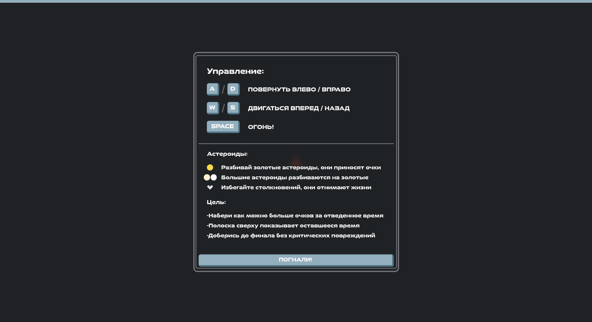
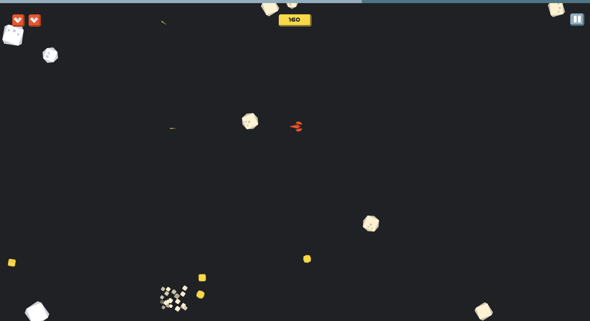
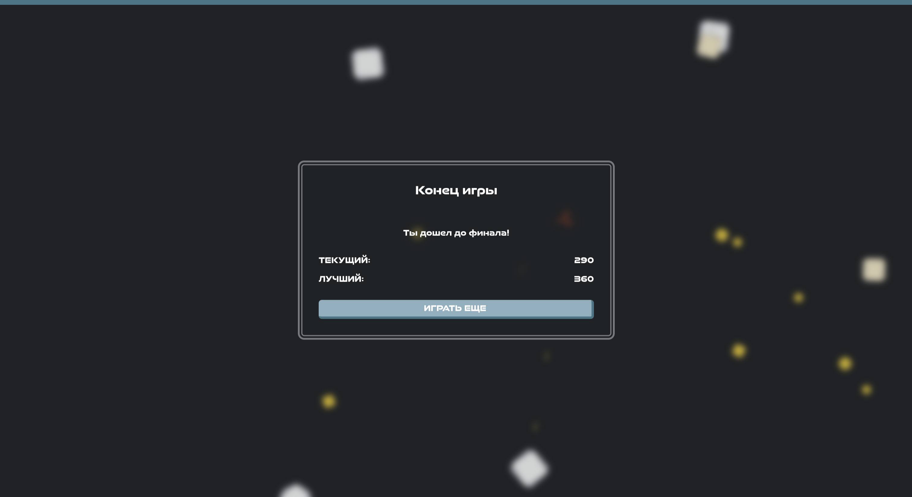

# Pixi Asteroids

### Демо: https://pixiasteroids.netlify.app

### Screenshots:

### Tools:
- **TypeScript**
- **Vite** сборка приложения
- **PixiJS** для рендеринга и сцен графа
- **GSAP** для твин анимаций
- **VUE3 (composition api)** фреймворк для фронтда
- **Pinia (composition api)** как менеджер состояний
- **SCSS** для стилей

### About game:
- Вариация игры Asteroids, где игрок управляет космическим кораблем и уничтожает астероиды
- За золотые астероиды дают очки
- Из больших астероидов выпадают золотые
- Необходимо набрать как можно больше очков за отведенное время
- При столкновении с астероидом игрок теряет жизнь
- При потери жизни дается уязвимость на время
- Платформа: десктоп веб
- Лучший счет сохраняется в localStorage
- UI написан на Vue3
